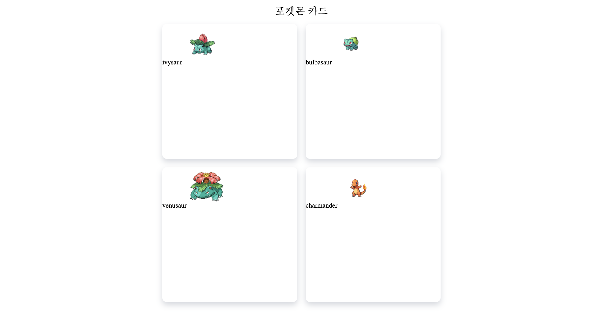

# Today I Learned

>  매일 배운 내용을 정리합니다.

## 200622

- 뷰를 이용해 앤트픽 랜딩페이지를 만들어보았다.
- 이미지가 한 화면에 꽉차게 배치하였고, 버튼을 클릭하면 앱다운로드 링크가 렌더링되도록 했다. 아직 앱링크가 없어서 페이지만 연결시켰다.
- 백그라운드 이미지 넣기

```
.hello {
  background-image: url('~@/assets/ants_1920_1280.jpg');
  background-size: cover;
  background-position: center;
  height: 100vh;
  display: flex;
  flex-direction: column;
  justify-content: center;
  align-items: center;
  text-align:center;
  padding: 0 20px;
}

.hello .box{
  position: relative;
  max-width: 600px;
  padding: 50px;
  background: rgba(255,255,255,.7);
  box-shadow: 0 5px 15px rgba(0,0,0,.5);
  border-radius: 10px;
}
.hello h1{
  font-size: 50px;
  line-height: 1.2;
}
```

- 물결없이 '@/assets//ants_1920_1280.jpg' 로 해주니까 안됨. 물결해주기
- 플렉스로 4칸 가로길이 같게 배열 하는 방법

```
#section-c{
  display:flex;
  flex-wrap: wrap;
  text-align:center;
}

#section-c div{
  padding:20px;
  flex:1;
}
```

- 플렉스, flex:1;
- flex:1;은 `flex-grow: 1;` 과 같다., 자동으로 플렉스 아이템들의 너비가 플렉스 컨테이너의 너비를 기준으로 알맞게 같은너비를 가지고 확장된다.

- html 꿀팁

```
div#section-a 하고 탭키를 누르면
<div id="section-c"></div>이 뙇!
.box1 하고 탭키를 누르면
<div class="box1"></div>이 뙇!
lorem20 탭키 누르면
lorem 20글자가 뙇!
```

- aws를 이용해 뷰 배포도 진행해보았고, 문서로 정리했다. 블로그에 올릴예정

## 200708

- 깃에 대해 더 공부했다

- git 충돌이 나도 당황하지 말자

- 오류 메시지 나오면 당황하지 말고 git lab에서 커밋내역이랑 local에서 git log 비교해보자

- 해결방법은 git pull origin master하고 , 병합해서 푸쉬하면 된다

- 충돌 상황을 고쳤다면 git add . , git commit 하면 자동으로 커밋메시지가 저장되어 있음을 확인할 수 있다

- |MERGING 플래깅이 없어졌다면 해결된 것이고, 이 상태에서 git push origin master하면 잘 올라간다

- 충돌 상황 시나리오에 대해 생각해 보면 크게 세 가지 이다.

- 상황1: fast-foward: feature 브랜치 생성된 이후 master 브랜치에 변경 사항이 없는 상황, 즉 혼자 쌓아나갈 때

- 상황2: 서로 다른 이력(commit)을 병합(merge)하는 과정에서 **다른 파일이 수정**되어 있는 상황 => git이 auto merging을 진행하고, **commit이 발생된다.**

- 상황3: 서로 다른 이력(commit)을 병합(merge)하는 과정에서 **같은 파일의 동일한 부분이 수정**되어 있는 상황

  git이 auto merging을 하지 못하고, 충돌 메시지가 뜬다.

  - 해당 파일의 위치에 표준형식에 따라 표시 해준다.

  - 원하는 형태의 코드로 직접 수정을 하고 직접 commit을 발생 시켜야 한다.

- 같은 파일을 수정했을 경우에는 이력을 바로 합칠 수 없음
- 이 때는 우리가 선택하면 됨. 파일을 열어보면 head 플래그(지금 내가 작업한 곳)랑, incoming Change 플래그 삭제해주고 내가 남기고 싶은 부분만 남기면 됨. 파일을 수정 하고 깃에드 깃커밋 깃푸쉬 ㄱㄱ

## 200709

- 깃에 대해 더 공부했다.

- 깃헙에서는 pull request, 깃랩에서는 merge request라는 표현을 쓴다

- pull request의 의미

  - **내가 작업한 코드가 있으니 내 브랜치를 당겨 검토 후 병합해주세요 (^0^)/**
  - **풀 리퀘스트를 이용한 흐름은 GitHub의 원격 저장소를 각자의 계정으로 Fork해 간 뒤에 fork 한 저장소를 클론 받아서 작업용 브랜치를 하나 만들어서 작업하고 이를 Fork 한 저장소에 푸시해서 풀 리퀘스트로 원격 저장소에 보내는 방식이다**

- 깃헙 플로우

  1. 프로젝트를 `Fork` 한다.
  2. `master` 기반으로 토픽 브랜치를 만든다.
  3. 뭔가 수정해서 커밋한다.
  4. 자신의 GitHub 프로젝트에 브랜치를 Push 한다.
  5. GitHub에 Pull Request를 생성한다.
  6. 토론하면서 그에 따라 계속 커밋한다.
  7. 프로젝트 소유자는 Pull Request를 Merge 하고 닫는다.

  > [https://git-scm.com/book/ko/v2/GitHub-GitHub-%ED%94%84%EB%A1%9C%EC%A0%9D%ED%8A%B8%EC%97%90-%EA%B8%B0%EC%97%AC%ED%95%98%EA%B8%B0](https://git-scm.com/book/ko/v2/GitHub-GitHub-프로젝트에-기여하기)

- 깃포크: 내가 권한이 없는 곳에서 고치고 싶을 때 포크를 이용한다.

  - 참여하고 싶은 프로젝트가 생기면 아마 그 프로젝트에 Push 할 권한은 없을 테니까 “Fork” 해야 한다. “Fork” 하면 GitHub이 프로젝트를 통째로 복사해준다. 그 복사본은 사용자 네임스페이스에 있고 Push 할 수도 있다.
  - 내가 권한이 없는 곳에서 고치고 싶을 때 포크를 이용한다.
  - 포크를 이용하면 url이 내 아이디로 바뀌고, 내 저장소로 포크한 것이 가져와진다.
  - 수정을하고, 에드 커밋한다(로컬에서 깃 클론해서 수정해도 됨)
  - git push origin master한다
  - 이제 내 프로젝트에는 반영이 됐고, 포크한 원래 프로젝트에는 반영이 안된상태이다.
  - pull requests 클릭 > New pull request 클릭 > Create pull reuquest 클릭하면 원래 포크주인에게 pull request가 보내진다

- 더 알아보면 좋은 것: rebase

> https://tech.10000lab.xyz/git/git-rebase-workflow.html

## 200730

파비콘

- vue.js 에서 파비콘과 타이틀을 수정했다
- 파비콘 파일을 public/favicon.io 이다
- io 파일이 더 좋은 지 png가 더 좋은 지에 대해 정리한 글이 있었는데 아직 이해가 힘들다
- 파비콘을 등록하는 것은 쉬워보였지만 경로설정을 잘못하는 바람에 한 참을 헤맸다
- 자세한 내용은 블로그에 적겠다

## 200805

자바스크립트 공부 시작!

> https://poiemaweb.com/

자바스크립트는 개발자가 별도의 컴파일 작업을 수행하지 않는 **[인터프리터](https://ko.wikipedia.org/wiki/인터프리터) 언어(Interpreter language)**이다. 대부분의 모던 자바스크립트 엔진(Chrome의 V8, FireFox의 Spidermonkey, Safari의 JavaScriptCore, Microsoft Edge의 Chakra 등)은 인터프리터와 컴파일러의 장점을 결합하여 비교적 처리 속도가 느린 인터프리터의 단점을 해결했다. 인터프리터는 소스코드를 즉시 실행하고 컴파일러는 빠르게 동작하는 머신 코드를 생성하고 최적화한다. 이를 통해 컴파일 단계에서 추가적인 시간이 필요함에도 불구하고 보다 빠른 코드의 실행이 가능하다.

자바스크립트는 [명령형(imperative)](https://ko.wikipedia.org/wiki/명령형_프로그래밍), [함수형(functional)](https://ko.wikipedia.org/wiki/함수형_프로그래밍), [프로토타입 기반(prototype-based) 객체지향 프로그래밍](https://ko.wikipedia.org/wiki/프로토타입_기반_프로그래밍)을 지원하는 [멀티 패러다임 프로그래밍 언어](https://ko.wikipedia.org/wiki/다중_패러다임_프로그래밍_언어)다.

비록 다른 객체지향 언어들과의 차이점에 대한 논쟁들이 있긴 하지만, 자바스크립트는 강력한 객체지향 프로그래밍 능력을 지니고 있다. 간혹 클래스(ES6에서 새롭게 도입되었다), 상속, 정보 은닉을 위한 키워드 private가 없어서 객체지향 언어가 아니라고 오해하는 경우도 있지만 자바스크립트는 클래스 기반 객체지향 언어보다 효율적이면서 강력한 **프로토타입 기반의 객체지향 언어**이다.

> 콘솔에서 디버깅 하는 방법
>
> https://developers.google.com/web/tools/chrome-devtools/javascript/?hl=ko

**body 요소의 가장 아래에 자바스크립트를 위치시키는 것이 좋은 이유 2가지**

- HTML 요소들이 스크립트 로딩 지연으로 인해 렌더링에 지장 받는 일이 발생하지 않아 페이지 로딩 시간이 단축된다.
- DOM이 완성되지 않은 상태에서 자바스크립트가 DOM을 조작한다면 에러가 발생한다.

**자바스크립트의 모든 값은 데이터 타입을 갖는다. 자바스크립트는 7가지 데이터 타입을 제공한다.**

- 원시 타입 (primitive data type), 기본 타입
  - 원시 타입의 값은 [변경 불가능한 값(immutable value)](https://poiemaweb.com/js-immutability)이며 **[pass-by-value(값에 의한 전달)](https://poiemaweb.com/js-object#5-pass-by-value)** 이다.
  - `number`
  - `string`
  - `boolean`
  - `null`
  - `undefined`
  - `symbol` (New in ECMAScript 6)
- 객체 타입 (Object data type)
  - `object`

**동적 타이핑**

자바스크립트는 C나 Java외는 다르게 변수를 선언할 때 데이터 타입을 미리 지정하지 않는다. 다시 말해, 변수에 할당된 값의 타입에 의해 동적으로 변수의 타입이 결정된다. 이를 동적 타이핑이라 하며 자바스크립트가 다른 프로그래밍 언어와 구별되는 특징 중 하나이다.

```
var foo = 42;    // foo 는 이제 Number 임
var foo = "bar"; // foo 는 이제 String 임
var foo = true;  // foo 는 이제 Boolean 임
```

- 타입은 프로그램이 처리되는 과정에서 자동으로 파악됨
- 같은 변수에 여러 타입의 값을 넣을 수 있음

한줄 주석은 `//` 다음에 작성하며 여러 줄 주석은 `/*`과 `*/`의 사이에 작성한다.

다른 언어와 달리 자바스크립트에서는 블록 유효범위(Block-level scope)를 생성하지 않는다. 함수 단위의 유효범위(Function-level scope)만이 생성된다.

원시 타입(Primitives)을 제외한 나머지 값들(함수, 배열, 정규표현식 등)은 모두 객체이다.

오늘은 자바스트립트의 개념과 기본 문법에 대해 학습했다.

다음 공부가 기대된다.

## 200806

### 1. Today I Learned

자바스크립트 공부 시작!

자바스크립트의 숫자 타입은 모든 수를 실수를 처리한다. 정수로 표시된다해도 사실은 실수다. 따라서 정수로 표시되는 수 끼리 나누더라도 실수가 나올 수 있다.

추가적인 수 표현

- `Infinity` : 양의 무한대
- `-Infinity` : 음의 무한대
- `NaN` : 산술 연산 불가(not-a-number)

자바스크립트의 문자열은 원시 타입이며 변경 불가능(immutable)하다. 이것은 한 번 문자열이 생성되면, 그 문자열을 변경할 수 없다는 것을 의미한다

새로운 문자열을 재할당하는 것은 가능함

```javascript
var str = "string";
// 문자열은 유사배열이다. 배열처럼 인덱스를 통해 접근가능
for (var i = 0; i < str.length; i++) {
  console.log(str[i]);
}

// 문자열을 변경할 수 없다.
str[0] = "S";
console.log(str); // string
```

null

```javascript
var foo = null;
console.log(typeof foo === null); // false
console.log(foo === null); // true
```

var 키워드로 선언된 변수의 문제점

1. 함수 레벨 스코프(Function-level scope)
   - 전역 변수의 남발
   - for loop 초기화식에서 사용한 변수를 for loop 외부 또는 전역에서 참조할 수 있다.
2. var 키워드 생략 허용
   - 의도하지 않은 변수의 전역화
3. 중복 선언 허용
   - 의도하지 않은 변수값 변경
4. 변수 호이스팅
   - 변수를 선언하기 전에 참조가 가능하다.

전역 변수는 유효 범위(scope)가 넓어서 어디에서 어떻게 사용될 지 파악하기 힘들다. 이는 의도치 않은 변수의 변경이 발생할 수 있는 가능성이 증가한다. 또한 여러 함수와 상호 의존하는 등 부수 효과(side effect)가 있을 수 있어서 복잡성이 증가한다.

변수의 유효 범위(scope)는 좁을수록 좋다.

ES6는 이러한 var의 단점을 보완하기 위해 [let과 const 키워드](https://poiemaweb.com/es6-block-scope)를 도입하였다.

### 2. Today I Found Out

자바스크립트 데이터타입과 변수에 대해 학습했다. 술술 읽어나갈 수는 있다. 그러나 그냥 읽어서는 남에게 설명해줄 수는 없을 것 같다. 어제배운 자바스크립트의 타입과 동적타이핑, var 키워드로 선언된 변수의 문제점를 외워야지!

## 200807

### https://poiemaweb.com/ 공부 -7. 연산자

문은 리터럴, 연산자, 표현식, 키워드 등으로 구성되며 세미콜론( ; )으로 끝나야 한다. (코드 블록 { … }은 제외)

```javascript
var x = 5,
  result;

// 선대입 후증가 (Postfix increment operator)
result = x++;
console.log(result, x); // 5 6

// 선증가 후대입 (Prefix increment operator)
result = ++x;
console.log(result, x); // 7 7

// 선대입 후감소 (Postfix decrement operator)
result = x--;
console.log(result, x); // 7 6

// 선감소 후대입 (Prefix decrement operator)
result = --x;
console.log(result, x); // 5 5
```

`+` 연산자는 피연산자 중 하나 이상이 문자열인 경우 문자열 연결 연산자로 동작한다. 그 외의 경우는 덧셈 연산자로 동작한다.

```javascript
// 문자열 연결 연산자
"1" + "2"; // '12'
"1" + 2; // '12'

// 산술 연산자
1 + 2; // 3
1 + true; // 2 (true → 1)
1 + false; // 1 (false → 0)
true + false; // 1 (true → 1 / false → 0)
1 + null; // 1 (null → 0)
1 + undefined; // NaN (undefined → NaN)
```

동등/ 일치 비교 연간자

| 비교 연산자 | 의미        | 사례    | 설명                     |
| :---------: | :---------- | :------ | :----------------------- |
|     ==      | 동등 비교   | x == y  | x와 y의 값이 같음        |
|     ===     | 일치 비교   | x === y | x와 y의 값과 타입이 같음 |
|     !=      | 부등 비교   | x != y  | x와 y의 값이 다름        |
|     !==     | 불일치 비교 | x !== y | x와 y의 값과 타입이 다름 |

동등 비교 연산자는 편리한 경우도 있지만 수많은 부작용을 일으키므로 사용하지 않는 편이 좋다.

```javascript
NaN === NaN; // false
isNaN(NaN); // true
```

삼항연산자

```
조건식 ? 조건식이 ture일때 반환할 값 : 조건식이 false일때 반환할 값
```

논리연산자

| 논리 연산자 |    의미     |
| :---------: | :---------: |
|    \|\|     | 논리합(OR)  |
|     &&      | 논리곱(AND) |
|      !      |  부정(NOT)  |

```javascript
// 논리합(||) 연산자
true || true; // true
true || false; // true
false || true; // true
false || false; // false

// 논리곱(&&) 연산자
true && true; // true
true && false; // false
false && true; // false
false && false; // false

// 논리 부정(!) 연산자
!true; // false
!false; // true
```

쉼표연산자

쉼표(,) 연산자는 왼쪽 피연산자부터 차례대로 피연산자를 평가하고 마지막 피연산자의 평가가 끝나면 마지막 피연산자의 평가 결과를 반환한다.

```javascript
var x, y, z;
(x = 1), (y = 2), (z = 3); // 3
```

type of 연산자

```javascript
typeof ""; // "string"
typeof 1; // "number"
typeof NaN; // "number"
typeof true; // "boolean"
typeof undefined; // "undefined"
typeof Symbol(); // "symbol"
typeof null; // "object"
typeof []; // "object"
typeof {}; // "object"
typeof new Date(); // "object"
typeof /test/gi; // "object"
typeof function () {}; // "function"
```

주의해야 할 것은 typeof 연산자로 null 값을 연산해 보면 null이 아닌 “object”를 반환한다는 것이다. 이것은 자바스크립트의 첫 번째 버전에서 이렇게 설계된 것을 현재의 버전에 반영하지 못하고 있기 때문이다

따라서 null 타입을 확인할 때는 typeof 연산자를 사용하지 말고 일치 연산자(===)를 사용하도록한다.

```javascript
typeof undeclared; // "undefined"
```

선언하지 않은 식별자를 typeof 연산자로 연산해 보면 ReferenceError가 발생하지 않고 “undefined”를 반환한다.

## JavaScript30 day1

Window와 document

> https://www.zerocho.com/category/JavaScript/post/573b321aa54b5e8427432946

윈도우

- 윈도우는 브라우저 최상위 객체이다. **브라우저**의 요소들과 자바스크립트 엔진, 그리고 모든 **변수**를 담고 있는 객체. 생략 가능

document

- . document도 윈도우 객체의 속성이기 때문에 `window.document` 로 접근. 하지만 window는 생략 가능(전역 객체)하기 때문에 그냥 **document**로 접근

```javascript
document.getElementById(아이디);
document.getElementsByClassName(클래스),
  document.getElementsByName(이름),
  document.getElementsByTagName(태그);
document.querySelector(선택자), document.querySelectorAll(선택자);
//css 선택자로 선택할 수 있게 해줍니다. 아이디는 #, 클래스는 .(점)
//태그명[속성명=속성값] 같은 것도 할 수 있고, 부모 > 자식, 부모 자손 등등 css의 선택자는 거의 다 쓸 수 있습니다.
//  const audio = document.querySelector(`audio[data-key="${e.keyCode}"]`);

var div = document.createElement("div"); // 메모리에 div가 생성됨
```

`**Document.getElementById()**` 메서드는 주어진 문자열과 일치하는 [`id`](https://developer.mozilla.org/ko/docs/Web/API/Element/id) 속성을 가진 요소를 찾고, 이를 나타내는 [`Element`](https://developer.mozilla.org/ko/docs/Web/API/Element) 객체를 반환합니다. ID는 문서 내에서 유일해야 하기 때문에 특정 요소를 빠르게 찾을 때 유용합니다.

ID가 없는 요소에 접근하려면 [`Document.querySelector()`](https://developer.mozilla.org/ko/docs/Web/API/Document/querySelector)를 사용하세요. 모든 [선택자](https://developer.mozilla.org/en-US/docs/Glossary/CSS_selector)를 사용할 수 있습니다.

```javascript
function changeColor(newColor) {
  var elem = document.getElementById("para");
  elem.style.color = newColor;
}
```

`**Array.from()**` 메서드는 유사 배열 객체(array-like object)나반복 가능한 객체(iterable object)를 얕게 복사해새로운`Array` 객체를 만듭니다.

```javascript
console.log(Array.from("foo"));
// expected output: Array ["f", "o", "o"]

console.log(Array.from([1, 2, 3], (x) => x + x));
// expected output: Array [2, 4, 6]
```

addEventListener

```javascript
// Function to change the content of t2
function modifyText() {
  var t2 = document.getElementById("t2");
  if (t2.firstChild.nodeValue == "three") {
    t2.firstChild.nodeValue = "two";
  } else {
    t2.firstChild.nodeValue = "three";
  }
}

// add event listener to table
var el = document.getElementById("outside");
el.addEventListener("click", modifyText, false);

/*output: 
one
two*/
```

이 코드에서, `modifyText()` 는 `addEventListener()`를 사용하여 등록된 `click` 이벤트에 대한 리스너입니다. 테이블의 아무곳이나 클릭하더라도, 핸들러에서 버블링되고 `modifyText()` 가 실행됩니다.

addEventListener 를 사용하면 클릭(첫번째 인자) 후 modifyText()가 실행된다

### Today I Found Out

- 자바스크립트 연산자에 대해 학습했다
- 윈도우 객체와 document 객체에 대해 학습했다
- document에서 속성에 접근하는 여러가지 방법에 대해 학습했다
- `**Array.from()**` 메서드
- `addEventListener()` 에 대해 학습했다
- 그동안 난 뭐를 공부했던 것일까....ㅎㅎㅎ 새롭게 알아가는 것들이 너무 많다.

## 200808

### react todolist

- 구현하고 싶은 것
- 수정하기를 눌렀을 때는 수정하기 상태가 된다. 수정하기 상태가 되면 인풋 창의 버튼은 할일 '추가' 버튼이 아닌 '수정' 버튼으로 바뀐다.
- 수정하기 상태에서 인풋 창에 값을 입력하고 '수정'버튼을 누르면 할일이 추가되고, '수정'버튼은 다시 '추가' 버튼으로 바뀐다.

- 오류

- 수정버튼을 누르면 edit 상태를 true로 바꾸려고 하는데 잘 안된다. setEdit is not a function 이라는 오류 메세지가 뜬다

- https://developer.mozilla.org/en-US/docs/Web/JavaScript/Reference/Errors/Not_a_function
- 해결중

```javascript
/* eslint-disable jsx-a11y/accessible-emoji */
import React, { useCallback } from "react";
import styled from "styled-components";
import emptyViewImage from "../assets/images/im-empty-view.png";
import { ToDoSubmitButton } from "./ToDoForm.jsx";

const ToDoListView = ({
  todolist,
  updateTodolist,
  deleteTodolist,
  toggleDoneTodolist,
  edit,
  setEdit,
}) => {
  const handleToggleDoneTodolist = useCallback(
    (id) => () => {
      toggleDoneTodolist(id);
    },
    [toggleDoneTodolist]
  );

  const handleDeleteTodolist = useCallback(
    (id) => () => {
      deleteTodolist(id);
    },
    [deleteTodolist]
  );

  const handleUpdateTodolist = useCallback(
    (edit) => () => {
      setEdit(true);
    },
    [setEdit]
  );

  if (todolist.length === 0) {
    return (
      <EmptyViewImage
        src={emptyViewImage}
        alt="리스트가 비었어요! 등록해주세요!"
      />
    );
  }

  return (
    <ListContainer>
      {todolist.map((item) => {
        if (item.isDelete) {
          return null;
        }
        return (
          <ListItemStyle key={item.id}>
            <ListContentGroup>
              <ListItemIcon>📝</ListItemIcon>
              <ListItemText isDone={item.isDone}>{item.text}</ListItemText>
            </ListContentGroup>
            <ListButtonGroup>
              <ListDoneButton onClick={handleToggleDoneTodolist(item.id)}>
                완료
              </ListDoneButton>
              <ListUpdateButton onClick={handleUpdateTodolist(item.id)}>
                수정
              </ListUpdateButton>
              <ListDeleteButton onClick={handleDeleteTodolist(item.id)}>
                삭제
              </ListDeleteButton>
            </ListButtonGroup>
          </ListItemStyle>
        );
      })}
    </ListContainer>
  );
};

export default ToDoListView;
```

## 200809

### react todolist

- 수정 버튼 구현
- 어제까지는 수정 상태 일 때, 인풋 창의 추가 버튼을 수정으로 바꿨었는데 오늘은 인풋창의 추가버튼을 그대로 두고, 수정 상태 일 때, 투두 리스트 목록에서 수정하고자 하는 투두 아이템이 텍스트에서 인풋창으로 바뀌도록 했다.
- 이를 위해 ToDoListView.jsx 에서 if문을 이용해 에딧 상태 일 때는 인풋 컴포넌트를 사용했고, 버튼은 수정 취소, 수정, 삭제 버튼을 보이게 했다. 에딧 상태가 아닐 때에는 텍스트 컴포넌트를 사용했고, 버튼은 완료, 수정, 삭제버튼을 보이게 했다 .
- 인풋 컴포넌트는 투두폼과 투두리스트뷰 에서 쓰고, onChange 이벤트를 만들어주었다. 처음에는 투두폼에서 만든 onChange를 그대로 이용했는데 그 결과, 투두리스트뷰의 인풋창에 값을 입력하는 대로 투두폼의 인풋창에도 같은 값이 나오는 바람에 투두리스트뷰의 onChange 를 다른 이름으로 따로 만들었다.
- const updateTodolist 는 사실 isEdit 상태만 true로 바꿔주고 싶었는데 왜 인지 그렇게는 안되었다.

```javascript
const updateTodolist = useCallback(
  (id, text) => {
    // const findIndex = [...todolist].findIndex((item) => item.id === id);
    const findTarget = [...todolist].find((item) => item.id === id);

    if (findTarget) {
      findTarget.isEdit = true;
    }

    // const list = [...todolist].filter((item) => item.id !== id);
    // list.splice(findIndex, 0, findTarget);
    // setTodolist(list);
  },
  [todolist]
);
```

- 이렇게 하면 투두리스트 아이템의 수정 버튼을 눌러도 먹통이다. 인풋창으로 바뀌어야하는데 바뀌지 않는다. 따로 에러메세지가 뜨진 않는다.

```
 const updateTodolist =  useCallback((id, text) => {

   const findIndex = [...todolist].findIndex((item) => item.id === id);
   const findTarget = [...todolist].find(item => item.id ===id);

   if (findTarget) {
     findTarget.isEdit = true;

   }

   const list = [...todolist].filter((item) => item.id !== id);
   list.splice(findIndex, 0, findTarget);
   setTodolist(list);
 }, [todolist]);
```

- 이렇게 하면 수정버튼을 클릭했을 때 투두리스트 아이템의 텍스트가 인풋창으로 잘 변한다
- 수정 상태에서 투두리스트 아이템 인풋창에 값을 입력하고, 수정버튼을 누르면 handleUpdateSubmitTodolist 이벤트가 발생하고, id 와 인풋내용이 인자로 전달된다. 인풋내용을 보내주지 않아서 findTarget.text 를 updatedText로 갱신해줄 수 없었는데 인풋내용을 인자로 전달하면서 해결했다.

### Today I Found Out

- 대부분의 문제는 프롭스를 잘 내려주고, 받는 것의 문제였다.
- 그동안은 머리로만 생각하고, 코드를 짜려니 뒤죽박죽 어려웠는데 노트에 해야할 것들을 정리하고, 하나씩 해결해나가니까 그나마 할만 했다. 다음부터는 노트를 이용해야겠다.
- edit 의 스테이트관리가 어려웠다. 다음 번엔 isEdit을 사용하지 않고, setEdit만으로 구현 가능 한지 알아봐야겠다.
- 추가, 삭제 함수를 계속 보면서 거의 베끼기 수준으로 수정 버튼을 구현하는데에도 꽤 오랜 시간이 걸렸다. 그래도 해냈으니 뿌듯하긴하다. 리스트를 추가했다가 모두 삭제했을 때 todolist의 길이가 0일 때 이미지를 띄우려고 했는데 그 부분이 잘 안된다. 다음에는 이 부분을 수정해봐야겠다. 앞으로도 리액트의 끈을 계속 잡고 있어야지..!^^

## 200810

### react todolist

- 변수명을 지을 떄는 좀 더 시맨틱하게! 변수명을 좀 더 의미가 있도록 바꿔주었다
- 시맨틱: 시맨틱 요소 = 의미있는 요소를 뜻하며, 이 시맨틱 요소는 브라우저와 개발자 모두에게 요소의 의미나 목적을 명확하게 설명해 줄 수 있는 요소이다.
- 푸쉬할 때는 console.log 를 지우자
- **스프레드 문법**

```
const updateCancelTodolist = useCallback((id)=> {
  const findTarget = [...todolist].find(item => item.id ===id);

  setTodolist([...todolist])
  console.log("[...todolist]:", [...todolist]);
  console.log("[todolist]: ", [todolist]);

  findTarget.isEdit = false;

}, [todolist])
```

- setTodolist로 todolist의 상태를 관리할 때, 스프레드를 사용하면 얻는 이점은 무엇일까?
- 우선 함수를 살펴보았다.
- 투두리스트에서 수정취소를 누를 때 실행되는 함수인데, 수정취소를 누르면 수정취소버튼을 누르기 전의 투두리스트 목록이 나타나야 한다.
- 투두리스트를 그대로 복사해서, todolist 상태를 보여주는 것이 수정취소 버튼을 구현했을 떄 가장 안전하게 todolist 목록을 보여줄 수 있을 것 같다. 내가 생각한 첫번째 장점은 안정성이다.
- 두번째 장점은 Spread 문법은 간편하게 배열을 복사할 수 있다는 장점이 있다.

> https://developer.mozilla.org/ko/docs/Web/JavaScript/Reference/Operators/Spread_syntax
>
> Spread 문법은 배열을 복사할 때 1 레벨 깊이에서 효과적
>
> https://medium.com/coding-at-dawn/how-to-use-the-spread-operator-in-javascript-b9e4a8b06fab
>
> https://medium.com/javascript-in-plain-english/how-to-add-to-an-array-in-react-state-3d08ddb2e1dc

**리액트 최적화**

> https://ui.toast.com/weekly-pick/ko_20161021/
> 성능 - 렌더링
> React 애플리케이션은 여러 컴포넌트들이 트리 형태로 구성되어 있다. 특정 컴포넌트의 상태가 변경될 때 하위 컴포넌트들이 연쇄적으로 렌더링 되며 운영되는 구조다.

React는 기본적으로 실제로 변경된 부분만을 가려내어 DOM을 조작하도록 하는 최적화된 렌더링 엔진을 가지고 있다. 공식 사이트에 있는 O(n3)의 복잡도를 O(n)으로 줄이려는 방법문서는 상당히 흥미진진한데 기본적인 가이드 문서만 잘 따르면 자연스럽게 이 알고리즘이 적용돼 서비스에 문제가 없는 성능을 보장한다.

오히려 React 공식 문서에는 어설픈 최적화는 디버깅을 어렵게 할 수 있으니 꼭 필요한 곳에서만 최적화를 적용하라고 가이드하고 있다.

그럼 정말 필요한 경우가 어디에 있을까? 사실 어떠한 상황이 그러하다고 딱 집어 말하기는 어렵다. 다만 이 글에서 제시하는 상황을 생각해 보면 어느 정도 판단이 설 것이다.

앞서 React 애플리케이션의 전체 구조는 컴포넌트의 트리라고 이야기했다. 특정 부모 컴포넌트의 상태가 변경될 때 모든 하위 컴포넌트가 렌더링 되는데 이때 몇몇 컴포넌트는 렌더링 되지 않아도 되거나 (A), 어떤 조건에서만 렌더링 되면 되는 경우(B)가 있다. 이 부분이 바로 최적화 포인트이다.

가장 간단한 예를 들어보면 (A)는 마크업만 포함하는 컴포넌트를 들 수 있다. 물론 오버헤드가 크지 않겠지만 앱의 성능에 문제가 있는 경우 비슷한 컴포넌트 여럿에 적용해서 도움이 될 수도 있다.

반복적인 목록을 렌더링하는 경우 (B) 최적화는 큰 도움이 될 수 있다. 예를 들어 할 일 내용, 마감 시간, 선택 여부를 관리할 수 있는 TODO 목록이 있다고 하자. 3 가지 상태 중 뷰에 나타나는 것은 오직 할 일의 내용과 선택 여부뿐이다. 마감 시간의 변경은 웹 페이지에 나타나지 않아도 된다. 그렇다면 할 일 내용, 선택 여부 두 가지 상태의 변경만 DOM 조작으로 이어지면 된다. 그 조건을 shouldComponentUpdate 에 구현하면 목록의 양에 비례한 엄청난 성능 향상을 이룰 수 있다.

훌륭한 설계자는 조급하게 코드 최적화를 하지 않는다. React의 트리 렌더링 성능 최적화 방식은 이 말에 충실한 계획적 최적화를 가능하게 한다. 개인적으로 React를 선호하는 이유이기도 하다.

### Today I Found Out

- spread 문법이 주는 장점에 대해 생각해봤다. 간편하다는 점 말고도 다른 장점이 또 장점이 있을 것 같다.
- 일단 오늘은 react에서 setState를 할 떄, 스프레드 문법을 사용해 State 관리를 할 수 있다는 것 정도는 기억해야겠다.
- 리액트의 성능적인 측면에 관한 블로그 글을 읽었다. 리액트는 변경된 부분만 가려내 DOM을 조작하도록 하는 최적화된 렌더링 엔진을 가지고 있다고 한다. 최적화 포인트가 어디가 될 지 잘 감이 오지 않는다. 이 부분에 대해 더 공부해보고 싶다.

## 200812


- 내가 쓴 댓글을 삭제하려고 한다. 405 에러가 뜬다.

- delete 요청 주소를 잘못보내서 그랬다. `getUserCommentedPosts`를 `comments` 로 바꿔주니까 된다.
- 스웨거를 잘 확인해야한다. delete 주소로 요청을 보내야 된다.

```
  deleteComment(data) {
      if (confirm("정말로 작성하신 댓글을 삭제하실 건가요?")) {
        console.log(data, "deletedata");
        axios.delete(process.env.VUE_APP_API_URL + "comments", {
          params: {
            commentsid: data,
          },
        });
      }
    },
```

- 추천 목록 받아오기

```vue
<template>
  <div class="recent">
    이 포스트는 어떠세요? - 현재 보고 계시는 포스트와 관련이 많은 포스트 입니다
    <hr />
    <div v-for="view in recommendViews" :key="view.postid">
      {{ view.title }} {{ view.createdat.split("T")[0] }}
    </div>
  </div>
</template>
<script>
data: () => {
        return {
            recommendViews: [],
        };
    },
    created() {
      this.getRecommendView();
    },

     getRecommendView() {
         // console.log(this.$route.params.id, "paramsid");
         axios
             .post(process.env.VUE_APP_API_URL + "getPopluarpostrelated", {
             postid: this.$route.params.id,
         })
             .then(({ data }) => {
             // console.log(data.object[0].posts, "getrecommenddata!!!!");
             this.recommendViews = data.object[0].posts;
         });
   },
</script>
```

### 0814

```
[Vue warn]: Error in created hook: "TypeError: this.getRecommendView is not a function"

found in

---> <Detail> at src/page/post/Detail.vue
       <App> at src/App.vue
         <Root>
warn @ webpack-internal:///./node_modules/vue/dist/vue.esm.js:629
webpack-internal:///./node_modules/vue/dist/vue.esm.js:1896 TypeError: this.getRecommendView is not a function
    at VueComponent.created (webpack-internal:///./node_modules/cache-loader/dist/cjs.js?!./node_modules/babel-loader/lib/index.js!./node_modules/cache-loader/dist/cjs.js?!./node_modules/vue-loader/lib/index.js?!./src/page/post/Detail.vue?vue&type=script&lang=js&:255)
    at invokeWithErrorHandling (webpack-internal:///./node_modules/vue/dist/vue.esm.js:1862)
    at callHook (webpack-internal:///./node_modules/vue/dist/vue.esm.js:4222)
    at VueComponent.Vue._init (webpack-internal:///./node_modules/vue/dist/vue.esm.js:5007)
    at new VueComponent (webpack-internal:///./node_modules/vue/dist/vue.esm.js:5153)
    at createComponentInstanceForVnode (webpack-internal:///./node_modules/vue/dist/vue.esm.js:3289)
    at init (webpack-internal:///./node_modules/vue/dist/vue.esm.js:3120)
    at merged (webpack-internal:///./node_modules/vue/dist/vue.esm.js:3307)
    at createComponent (webpack-internal:///./node_modules/vue/dist/vue.esm.js:5979)
    at createElm (webpack-internal:///./node_modules/vue/dist/vue.esm.js:5926)
logError @ webpack-internal:///./node_modules/vue/dist/vue.esm.js:1896

```

https://dev.to/sewvandiii/npm-err-cannot-read-property-match-of-undefined-3hb5

```
$ npm install
npm WARN deprecated fsevents@1.2.13: fsevents 1 will break on node v14+ and could be using insecure binaries. Upgrade to fsevents 2.

> yorkie@2.0.0 install C:\Users\loci\s03p13a610\frontend\node_modules\yorkie
> node bin/install.js

'node'은(는) 내부 또는 외부 명령, 실행할 수 있는 프로그램, 또는
배치 파일이 아닙니다.
npm WARN optional SKIPPING OPTIONAL DEPENDENCY: fsevents@^1.2.7 (node_modules\chokidar\node_modules\fsevents):
npm WARN notsup SKIPPING OPTIONAL DEPENDENCY: Unsupported platform for fsevents@1.2.13: wanted {"os":"darwin","arch":"any"} (current: {"os":"win32","arch":"x64"})
npm WARN optional SKIPPING OPTIONAL DEPENDENCY: fsevents@~2.1.2 (node_modules\firebase-tools\node_modules\chokidar\node_modules\fsevents):
npm WARN notsup SKIPPING OPTIONAL DEPENDENCY: Unsupported platform for fsevents@2.1.3: wanted {"os":"darwin","arch":"any"} (current: {"os":"win32","arch":"x64"})
npm WARN optional SKIPPING OPTIONAL DEPENDENCY: fsevents@~2.1.2 (node_modules\watchpack\node_modules\chokidar\node_modules\fsevents):
npm WARN notsup SKIPPING OPTIONAL DEPENDENCY: Unsupported platform for fsevents@2.1.3: wanted {"os":"darwin","arch":"any"} (current: {"os":"win32","arch":"x64"})
npm WARN @vue/compiler-sfc@3.0.0-rc.5 requires a peer of vue@3.0.0-rc.5 but none is installed. You must install peer dependencies yourself.
npm WARN vue-awesome-swiper@4.1.1 requires a peer of swiper@^5.2.0 but none is installed. You must install peer dependencies yourself.

npm ERR! code ELIFECYCLE
npm ERR! errno 1
npm ERR! yorkie@2.0.0 install: `node bin/install.js`
npm ERR! Exit status 1
npm ERR!
npm ERR! Failed at the yorkie@2.0.0 install script.
npm ERR! This is probably not a problem with npm. There is likely additional logging output above.

npm ERR! A complete log of this run can be found in:
npm ERR!     C:\Users\multicampus\AppData\Roaming\npm-cache\_logs\2020-08-13T03_51_49_557Z-debug.log

```

- 상속

```vue
<div class="col">
           <!-- <div class="social"> 요걸 지워주면 된다-->
              <p>간편로그인</p>
              <div class="btn" @click="kakaoLogin">
                Login with KaKaoTalk
              </div>
              <a href="#" class="github btn" @click="githubLogin">
                Login with Github
              </a>
              <a href="#" class="naver btn" @click="naverLogin">
                Login with Naver
              </a>
            <!--  </div>-->
          </div>
```


# 200814

- 배경 이미지 넣기

```
.sang {
  background-image: url("~@/assets/img/welcome.jpg");
  background-size: cover;
  padding: 0;
  margin: 0;
  border: 0;
  top: 0;
  left: 0;
}
```

> https://coder-coder.com/background-image-opacity/

- padding-bottom:1rem으로 처리하긴 핸쓴데... 원래는 로그인 하시겠어요? 로그인 div에 주고 싶었는데 패딩 탑음 먹히는데 바텀이 안먹힘..미스터리..


```
<template>
  <div>
    <div class="user wrap" id="login" style="height: auto">
      <div v-if="!issignup" class="container">
        <h2 style="text-align:center; padding-top: 3%; margin-bottom: 5%">
          Login
        </h2>
        <div class="row">
          <div class="col" style="padding-left:5%; padding-right:5%">
            <p>간편로그인</p>
            <div class="kakao btn" @click="kakaoLogin">
              Login with KaKaoTalk
            </div>
            <a href="#" class="github btn" @click="githubLogin">
              Login with Github
            </a>
            <a href="#" class="naver btn" @click="naverLogin">
              Login with Naver
            </a>
          </div>
          <div>
            <span class="vl-innertext"><b>or</b></span>
          </div>

          <div class="col">
            <p>일반로그인</p>
            <input
              type="text"
              v-model="Login.email"
              id="email"
              placeholder="이메일을 입력해주세요"
              required
            />
            <input
              v-model="Login.password"
              type="password"
              id="password"
              username="password"
              placeholder="비밀번호를 입력해주세요"
              required
            />
            <div class="attention">
              *영문, 숫자 혼용 8자 이상 입력해주세요
            </div>
            <input type="submit" value="Login" @click="checkHandler" />
            <!-- <div class="gotosignup"> -->
            <!-- <div style="float: left;">아직 회원이 아니신가요?</div>
              <div style="float: right;">
                <button @click="openSignupModal">회원가입</button>
              </div> -->
            <div class="readytosignup" style="width:90%">
              <div style="float:left">아직 회원이 아니신가요?</div>
              <div
                class="gotosignup"
                style="float:right"
                @click="openSignupModal"
              >
                회원가입
              </div>
            </div>
          </div>
        </div>
      </div>
    </div>
    <div class="user wrap" id="signup" style="height: auto">
      <div v-if="issignup" class="container">
        <div class="row">
          <div class="col hero">
            <!--  -->

            <div class="welcome">
              <h5>
                멋쟁이 상원이처럼 <br />
                블로그에 오신 것을 환영합니다. <br />
              </h5>
              <br />

              기억보단 기록을!!!
              <br />
              코딩 공부한 내용을<br />
              블로그에 기록하고 있어요<br />
              <br />
              저는 처음에 코딩을 시작할 때
              <br />
              어디서부터 시작할 지 막막했어요
              <br />
              어떻게 공부하면 좋을 지
              <br />
              코딩 커리큘럼도 소개해드립니다
              <br />
              <br />
              열심히 공부해서 같이
              <br />
              멋진 개발자가 됩시다:)
            </div>
          </div>

          <!-- <div class="vl">
          <span class="vl-innertext"><b>or</b> </span>
        </div> -->
          <div class="col">
            <div
              style="width:90% ;margin-top:5%; margin-bottom:20%; padding-left: 10%"
            >
              <h2 style="float:left">Signup</h2>
              <b-icon style="float:right" icon="x-circle" />
            </div>
            <div class="signup">
              <p style="font-weight:bold ; ">회원가입</p>
              <input
                type="text"
                :class="{ 'border-red': !isNickname }"
                v-model="nickName"
                id="nickName"
                placeholder="닉네임을 입력해주세요"
                maxlength="8"
                required
                @change="nickNameVal"
              />
              <input
                type="text"
                :class="{ 'border-red': !isEmail }"
                v-model="email"
                id="email"
                placeholder="이메일을 입력해주세요"
                required
                @change="emailVal"
              />
              <input
                :class="{ 'border-red': !isCheckEmailCode }"
                v-if="this.isEmailCodeSend"
                style="display:inline; width:40%; line-height: 20px; border:0px; border-bottom: 1px solid black"
                v-model="emailCode"
                @change="codeVal"
              />
              <div class="sendnumber" @click="emailValSend">
                인증번호 보내기
              </div>
              <input
                :class="{ 'border-red': !isPwd }"
                v-model="password"
                id="password"
                username="password"
                :type="passwordType"
                placeholder="비밀번호를 입력해주세요"
                required
                @change="pwdVal"
              />
              <div class="attention">
                *영문, 숫자 혼용 8자 이상 입력해주세요
              </div>
              <input
                :class="{ 'border-red': !isPwdConfirm }"
                v-model="passwordConfirm"
                :type="passwordConfirmType"
                id="password-confirm"
                username="password"
                placeholder="비밀번호를 한번 더 입력해주세요"
                required
                @change="pwdConfirmVal"
              />
              <div class="attention">
                *영문, 숫자 혼용 8자 이상 입력해주세요
              </div>
              <!-- <div class="confirm">
              <div style="float: left;">
                <input
                  v-model="isTerm"
                  type="checkbox"
                  id="term"
                  style="float: left;"
                />
                <label for="term" class="confirmMessage"
                  >약관에 동의합니다</label
                >
              </div>
              <div style="float: right; width:90%" class="go-term">
                약관 보기
              </div>
            </div> -->

              <input type="submit" value="Signup" @click="checkJoin" />
              <div style="width:90%;  padding-top:0.5rem;">
                <div style="float:left ">
                  로그인하시겠어요?
                </div>
                <div
                  class="gotologin"
                  style="float:right ;"
                  @click="openLoginModal"
                >
                  로그인
                </div>
              </div>
            </div>
          </div>
        </div>
      </div>
    </div>
  </div>
</template>

<script>
import constants from "../../lib/constants";
import axios from "axios";
// import Signup from "./Signup.vue";
import MyModal from "@/components/common/MyModal.vue";

export default {
  name: "Login",
  components: { MyModal },
  data: () => {
    return {
      Login: {
        constants,
        email: "",
        password: "",
        loginModal: false,
      },
      color: "white",
      email: "",
      nickName: "",
      password: "",
      passwordConfirm: "",
      isTerm: true, // 약관동의
      isEmail: false, // 올바른 이메일 형식 + 중복하지 않은 이메일
      isNickname: false, // 중복하지 않은 닉네임
      passwordType: "password",
      passwordConfirmType: "password",
      isEmailCodeSend: false, // 이메일 인증 번호를 전송한지 체크
      emailCode: "", // 인증 번호
      checkEmailCode: "", // 받아온 인증 번호
      isCheckEmailCode: false, // 인증 번호가 일치하는지 체크
      isPwd: false, // 비밀번호 올바른 형식
      isPwdConfirm: false,
      issignup: false,
      islogin: false,
    };
  },
  computed: {},
  created() {},

  watch: {},
  methods: {
    naverLogin() {
      axios.get(process.env.VUE_APP_API_URL + "naver").then(({ data }) => {
        if (data.apiURL) {
          location.href = data.apiURL;
        }
      });
    },
    kakaoLogin() {
      // console.log("here");
      axios.get(process.env.VUE_APP_API_URL + "kakao").then(({ data }) => {
        if (data.apiURL) {
          location.href = data.apiURL;
        }
      });
    },
    googleLogin() {
      // console.log(process.env.VUE_APP_API_URL + "kakao");
      axios.get(process.env.VUE_APP_API_URL + "google").then(({ data }) => {
        if (data.apiURL) {
          location.href = data.apiURL;
        }
      });
    },
    githubLogin() {
      // console.log(process.env.VUE_APP_API_URL + "kakao");
      axios.get(process.env.VUE_APP_API_URL + "github").then(({ data }) => {
        if (data.apiURL) {
          location.href = data.apiURL;
        }
      });
    },
    openSignupModal() {
      this.issignup = true;
    },
    openLoginModal() {
      this.issignup = false;
    },
    // closeSingupModal() {
    //   this.issignup = false;
    // },
    // closeModal() {
    //   this.Login.signupModal = false;
    // },
    checkHandler() {
      if (!this.Login.email) {
        alert("이메일을 입력해주세요.");
      } else if (!this.Login.password) {
        alert("패스워드를 입력해주세요.");
      } else this.login();
    },
    login() {
      axios
        .post(process.env.VUE_APP_API_URL + "account/socialCheck", {
          issocial: null,
          useremail: this.Login.email,
        })
        .then(({ data }) => {
          if (data.check == "1") {
            switch (data.socialtype) {
              case "K":
                alert("카카오로 회원가입이 되어있습니다.");
                break;
              case "N":
                alert("네이버로 회원가입이 되어있습니다.");
                break;
              case "GH":
                alert("깃허브로 회원가입이 되어있습니다.");
                break;
            }
          } else if (data.check == "2") {
            axios
              .post(process.env.VUE_APP_API_URL + "account/login", {
                useremail: this.Login.email,
                password: this.Login.password,
              })
              .then(({ data }) => {
                if (data.data == "success") {
                  alert("로그인 되었습니다.");
                  this.$store.commit("loginToken", data.object);
                  // console.log(data.object);
                  if (this.$route.path != "/") this.$router.push("/");
                } else {
                  alert("비밀번호가 틀렸습니다.");
                  // console.log(data);
                }
              })
              .catch(() => {
                if (this.$route.path != "/500")
                  this.$router.push("/500/로그인에 실패했습니다.");
              });
          } else {
            alert("존재하지 않는 이메일입니다.");
          }
        });
    },
    checkJoin() {
      if (!this.isPwd) {
        alert("비밀번호가 올바르지 않습니다.");
      } else if (!this.isPwdConfirm) {
        alert("비밀번호가 일치하지 않습니다.");
      } else if (!this.isNickname) {
        alert("닉네임이 올바르지 않습니다.");
      } else if (!this.isEmail) {
        alert("이메일이 올바르지 않습니다.");
      } else if (!this.isCheckEmailCode) {
        alert("이메일 인증 번호를 확인해주세요.");
      } else if (!this.isTerm) {
        alert("약관에 동의해주세요.");
      } else {
        this.join();
      }
    },
    join() {
      // form 검증
      axios
        .post(process.env.VUE_APP_API_URL + "account/signup", {
          username: this.nickName,
          password: this.password,
          useremail: this.email,
        })
        .then(({ data }) => {
          if (data.data == "success") {
            alert("회원가입에 성공하였습니다.");
            if (this.$route.path != "/") this.$router.push("/");
          } else {
            alert("실패");
            this.$router.push("/500");
          }
        });
    },
    emailValidate() {
      let regex = /^[0-9a-zA-Z]([-_\.]?[0-9a-zA-Z])*@[0-9a-zA-Z]([-_\.]?[0-9a-zA-Z])*\.[a-zA-Z]{2,3}$/i;
      return regex.test(this.email);
    },
    passwordValidate() {
      let regex = /^(?=.*\d)(?=.*[a-zA-Z])[0-9a-zA-Z]{8,}$/;
      return regex.test(this.password);
    },
    emailValSend() {
      if (this.email) {
        // axios로 코드 전송
        this.isEmailCodeSend = true; // 이메일을 보냈다는 뜻
        axios
          .post(process.env.VUE_APP_API_URL + "account/SendCheckEmail", {
            username: this.nickName,
            useremail: this.email,
          })
          .then(({ data }) => {
            if (data.data == "success") {
              alert("인증 번호 발송에 성공했습니다.");
              this.checkEmailCode = data.RandomNumber;
            } else {
              alert("인증 번호 발송에 실패했습니다.");
            }
          });
      } else if (!this.email) alert("이메일을 확인해주세요.");
      else alert("아이디를 확인해주세요.");
    },
    nickNameVal() {
      // console.log(this.nickName);
      axios
        .post(process.env.VUE_APP_API_URL + "account/usernameDuplicateCheck", {
          username: this.nickName,
        })
        .then(({ data }) => {
          // console.log(data);
          if (data.data == "success") {
            this.isNickname = true;
          } else {
            this.isNickname = false;
          }
        })
        .catch(function(error) {
          console.log("fail");
          this.isNickname = false;
        });
    },
    emailVal() {
      if (this.emailValidate()) {
        axios
          .post(process.env.VUE_APP_API_URL + "account/EmailDuplicateCheck", {
            useremail: this.email,
          })
          .then(({ data }) => {
            if (data.data == "success") {
              this.isEmail = true;
              // console.log("중복x");
            } else {
              this.isEmail = false;
              // console.log("중복o");
            }
          })
          .catch(function(error) {
            this.isEmail = false;
          });
      } else {
        this.isEmail = false;
      }
    },
    pwdVal() {
      if (!this.passwordValidate()) this.isPwd = false;
      else this.isPwd = true;
    },
    pwdConfirmVal() {
      if (this.password != this.passwordConfirm) this.isPwdConfirm = false;
      else this.isPwdConfirm = true;
    },
    codeVal() {
      if (this.checkEmailCode && this.checkEmailCode == this.emailCode.trim()) {
        this.isCheckEmailCode = true;
      } else this.isCheckEmailCode = false;
    },
  },
};
</script>

<style scoped>
/* .container {
  width: 90%;
  margin: 10px auto;
} */
.border-red {
  border: 2px solid darkred;
}
/* .t {
  padding-left: 5%;
} */
.social {
  float: left;
  width: 30%;
  padding-left: 2%;
}
.or {
  float: left;
  width: 10%;
  margin-top: 20%;
  padding-left: 4%;
  background-color: #f1f1f1;
}
.login {
  float: right;
  width: 60%;
  /* padding-right: 2%; */
}
.gotosignup {
  cursor: pointer;
}
.gotologin {
  cursor: pointer;
}
.sendnumber {
  cursor: pointer;
}
.attention {
  float: left;
  font-size: 0.8em;
}
/* .gotosignup {
  margin-top: 10px;
  margin-bottom: 10px;
} */
.wrap {
  width: 100%;
  float: left;
}
/* h2 {
  margin-top: 50px;
  margin-bottom: 50px;
} */
p {
  float: left;
  font-weight: bold;
  margin-bottom: 10px;
}

.container {
  position: relative;
  max-width: 700px;
  margin: auto;
  background-color: #f2f2f2;
  padding: 0;
  border: 0;
  /* padding: 20px 0 30px 0; */
}
form {
  border-radius: 20px;
}
input,
.btn {
  width: 90%;
  padding: 12px;
  border: none;
  border-radius: 4px;
  margin: 7px 0;
  opacity: 0.85;
  display: inline-block;
  font-size: 12px;
  line-height: 20px;
  text-decoration: none;
}
input:hover,
.btn:hover {
  opacity: 1;
}

.kakao {
  background-color: #f7e600;
  color: white;
  font-size: 13px;
}

.github {
  background-color: #dd4b39;
  color: white;
}
.naver {
  background-color: #2db400;
  color: white;
}
input[type="submit"] {
  background-color: #9a89d3;
  color: white !important;
  cursor: pointer;
  margin-top: 1rem;
}
input[type="submit"]:hover {
  background-color: #566270;
}
.col {
  float: left;
  width: 50%;
  margin: auto;
  /* padding: 0 50px; */
  margin-top: 10px;
  padding: 0;
  margin: 0;
  padding-bottom: 1rem;
}
.row {
  margin: 0;
  padding: 0;
}
.row:after {
  content: "";
  display: table;
  clear: both;
  padding: 0;
}

.signup {
  padding-left: 10%;
}
/* .vl {
  position: absolute;
  left: 50%;
  transform: translate(-50%);
  border: 2px solid #ddd;
  height: 270px;
}
.vl-innertext {
  position: absolute;
  top: 50%;
  transform: translate(-50%, -50%);
  background-color: #f1f1f1;
  border: 1px solid #ccc;
  border-radius: 50%;
  padding: 8px 10px;
} */
.vl {
  position: absolute;
  left: 50%;
  transform: translate(-50%);
  border: 2px solid #ddd;
  height: 250px;
}

.vl-innertext {
  position: absolute;
  top: 50%;
  left: 50%;
  transform: translate(-50%, -50%);
  background-color: #f1f1f1;
  border: 1px solid #ccc;
  border-radius: 50%;
  padding: 8px 10px;
}

.hide-md-lg {
  display: none;
}

.hero {
  position: relative;
  width: 100%;
  display: flex;
  align-items: center;
  justify-content: center;
  background-image: url("~@/assets/img/welcome.jpg");
  background-size: cover;
}

.hero::before {
  content: "";
  position: absolute;
  top: 0px;
  right: 0px;
  bottom: 0px;
  left: 0px;
  background-color: rgba(0, 0, 0, 0.7);
}

.welcome {
  position: relative;
  color: #ffffff;
  font-size: 1rem;
  line-height: 1.5;
  text-align: center;
  display: inline-block;
  width: 80%;
  margin: 5% 0;
}

h5 {
  font-weight: bold;
  color: #ffffff;
  line-height: 1.5;
}
@media screen and (max-width: 650px) {
  .col {
    width: 100%;
    margin-top: 0;
    border: 0;
  }
  .vl {
    display: none;
  }
  .hide-md-lg {
    display: block;
    text-align: center;
  }
  .col .sang {
    position: absolute;
    top: 0;
    left: 0;
    width: 100%;
    height: 100%;
    object-fit: cover;
    /*     background-image: url(https://placeimg.com/300/400/animals/grayscale);
 */
    border: 0;
  }
}
</style>

```

- 내가 쓴 댓글 불러오기, 댓글 누르면 상세 페이지로 이동, 삭제 구현

### html

**rem과 em**

em 단위는 `지정된 요소 (현재 요소)`의 폰트 크기를 기준으로 함. 만약 em 을 사용해 스타일을 지정한 요소에 따로 font-size 값이 지정되지 않았다면, 해당 요소는 부모요소로 부터 font-size 값을 상속(inherit) 받고, em 은 그 상속 받은 값을 기준으로 삼게 됩니다.

rem 단위는 문서의 최상위 요소인 `html 요소`의 폰트 크기를 기준으로 합니다.
em 단위는 모든 상위 부모 요소로부터의 폰트 크기를 상속받으면서 영향을 받을 수 있습니다.
rem 단위는 브라우저에 설정된 폰트 크기를 상속받는 특성이 있다.(브라우저 기본 폰트:16px)

em 단위는 최상위 요소에 지정된 폰트 크기 말고, 다른 특정 요소의 폰트 크기에 따라 그 크기가 변해야 하는 곳에 사용하십시오(주로 메뉴바)
rem 단위는 em 단위를 쓸 필요가 없고, 또 브라우저의 폰트 크기 설정에 따라 그 크기가 변해야 하는 곳에 사용하십시오.
폰트 크기 지정을 비롯해서 꼭 em 단위를 써야 하는 곳이 아니라면 rem 단위를 사용하십시오.
media queries에도 rem 단위를 쓰세요.
다중 칼럼 레이아웃의 너비에는 em 혹은 rem을 쓰진 마십시오 - 대신 %를 쓰세요.
만약에 크기가 변할 경우 해당 요소의 레이아웃이 깨지는 걸 막을 수 없다면 em과 rem 모두 쓰지 마세요.

> https://webdesign.tutsplus.com/ko/tutorials/comprehensive-guide-when-to-use-em-vs-rem--cms-23984

**rem이 반응형 홈페이지에 사용되는 이유**
미디어쿼리로 반응형을 제작할 때 브레이크 포인트에서 html 폰트사이즈만 변경해주면 하위rem 단위 크기가 모두 변경되기 때문에 편리하다

> https://yeoninim.tistory.com/38
> px:반응형 웹사이트를 만들때에는 적절하지 않습니다.

최상위에 html 태그가 있고, 그 밑에 body 태그로 본문 영역이 표시 되며, container 라는 클래스를 가진 div 요소 하위에 content1 과 content2 라는 클래스의 div 요소가 자리 잡고 있습니다.

```
html { font-size: 16px; }
body { font-size: 2em; }
div.container { font-size: 2em; }
div.content1 { font-size: 2rem; }
div.content2 { font-size: 2em; }
```

이 경우 content1 의 font-size 는 32px 이지만, content2 의 font-size 는 16px _ 2 _ 2 \* 2 이므로 128px 로 지정됩니다.

> http://triki.net/prgm/3250

## 200813

- 모달 로그인 창에서 사인업으로 넘어가려면, login.vue 와 같은 하나의 파일에 로그인 모달과 사인업 모달을 만들어주면 된다.
- 처음에는 로그인 모달 열듯이 사인업 모달을 같은 방법으로 열었었는데 이렇게 하면 사인업 모달을 닫으면 그 밑에 있던 로그인 모달이 뜬다.
- 이렇게 하는 것보다는 하나의 페이지에서 로그인과 사인업에 대한 플래그를 주고, v-if 를 이용하면 로그인 모달과 사인업 모달을 연결해서 띄울 수 있다.
- 모달 창을 반으로 쪼개서 왼쪽엔 소셜 로그인, 오른쪽엔 일반로그인을 구현하면서 row, col 을 이용해 양분화 했다.

## 200818

- 스와이퍼가 잘 안들어갔던 이유...번들을 임포트 안해줘서..!!!

~~~
import RecentSwiper from "../../components/common/RecentSwiper.vue";
import { swiper, swiperSlide } from 'vue-awesome-swiper'
import 'swiper/swiper-bundle.css'
~~~

- 홈

~~~
 <section id="banner">
            <div class="content">
              <header>
                <h1>
                  안녕하세요 상원입니다<br />
                  
                </h1>
                <p>A free and fully responsive site template</p>
              </header>
              <p>
                Aenean ornare velit lacus, ac varius enim ullamcorper eu. Proin
                aliquam facilisis ante interdum congue. Integer mollis, nisl
                amet convallis, porttitor magna ullamcorper, amet egestas
                mauris. Ut magna finibus nisi nec lacinia. Nam maximus erat id
                euismod egestas. Pellentesque sapien ac quam. Lorem ipsum dolor
                sit nullam.
              </p>
              <ul class="actions">
                <li><a href="#" class="button big">Learn More</a></li>
              </ul>
            </div>
            <span class="image object">
              
            </span>
          </section>
~~~

- slit  오류... slice로 고쳐서 해결

~~~javascript

       <div v-if="$store.state.useremail && recentViews.length > 0" class="postbox">
        <h6 class="postboxtitle">최근에 본 포스트입니다</h6>
        <div>
          <table class="alt">
            <thead>
              <tr>
                <th>Title</th>
                 <th>Date</th>
                <th>Writer</th>
              </tr>
            </thead>
            <tbody class="alt">
              <tr v-for="recent in recentViews" :key="recent.postid">
                <td   class="relative-title" @click="mvDetail(recent.postid)">{{ recent.title }} </td>
                <td >
{{ recent.createdat.slice(0,10) }}</td>
 
                <td>{{ recent.username }}</td>
              </tr>
            </tbody>
          </table>
        </div>
      </div>
~~~

> https://flaviocopes.com/vue-filters/
>
> https://www.telerik.com/blogs/everything-you-should-know-about-filters-in-vue

- preloader 고전 중..

  - 로드가 완료되는 시점을 못잡겠다
  - document.realStata =="complete" 안된

  

  

  

  

  

## 200819

- 페이지 로더

~~~vue
<template>
  <div id="page" class="page-loader" v-if="!isloaded">
    <div class="cube"></div>
    <div class="cube"></div>
    <div class="cube"></div>
</template>

<script>
  export default {
    data: () => {
      return {
        isloaded: false
      }
    },
    mounted() {
      document.onreadystatechange = () => {
        if (document.readyState == "complete") { 
          this.isloaded = true;
          console.log(document.getElementById('page'))
        } 
        else {
           console.log(document.getElementById('page'))

        }
      }
    },
  }
</script>

<style lang="scss" scoped>
   $colors: #8CC271, #69BEEB, #F5AA39, #E9643B;

  // -----------------------------------------------------

  .page-loader {
    display: flex;
    justify-content: center;
    align-items: center;
    position: fixed;
    top: 0;
    left: 0;
    width: 100vw;
    height: 100vh;
    background-color: #333;
    z-index: 999;
  }

  // -----------------------------------------------------

  .cube{
    width: 40px;
    height: 40px;
    margin-right: 10px;

    @for $i from 1 through length($colors) {
      &:nth-child(#{$i}) {
        background-color: nth($colors, $i);
      }
    }

    &:first-child {
      animation: left 1s infinite;
    }

    &:last-child {
      animation: right 1s infinite .5s;
    }
  }

  // -----------------------------------------------------

  @keyframes left {
    40% {
      transform: translateX(-60px);
    }
    50% {
      transform: translateX(0);      
    }
  }

  @keyframes right {
    40% {
      transform: translateX(60px);
    }
    50% {
      transform: translateX(0);
    }
  }
</style>
~~~

- 로딩

> https://codepen.io/Metty/pen/xJoWqq

# 200820

- 부트스트랩 뷰 호버 효과 주기

  > 스타일로 직접 박스 쉐도우 주면 박스 쉐도우는 먹힘
  >
  > https://www.positronx.io/build-responsive-carousel-in-vue-js-with-bootstrapvue/


- 모달 안에 스크롤 뷰 
- 로고 옆에 텍스트 가운데 정렬 

# 200822

## 리액트 클론 코딩

> https://github.com/facebook/create-react-app

~~~bash
npx create-react-app my-app
cd my-app
yarn start
~~~

- 로고 창을 만들어봅시다

### Fetch API

- ajax를 구현하는 여러가지 기술 중 하나이다.
- fetch로 response 객체를 받아옴
- response 객체로 받아서  text로 변환하거나 json 

 fetch 요청 후에 return 값이 Promise 객체이기 때문이죠. 참고로 Promise 객체는 ES2015 스펙이기 때문에 ES2015 문법을 사용하겠습니다. fetch 함수도 window 아래에 위치합니다.

response 객체? promise  객체?

~~~
fetch('주소', 설정객체).then(콜백).catch(콜백);

~~~

> https://www.zerocho.com/category/HTML&DOM/post/595b4bc97cafe885540c0c1c

~~~html
<html>
  <body>
      <input type="button" value="fetch" onclick="fetch('html').then(funtion(response){response.text().then(function(text){
                                                  document.querySelector('article').innerHTML = text;
                                                  })
                                                  })">
  </body>
</html>
~~~

### axios

Promise 기반의 Http 통신 라이브러리

axios는 node.js와 브라우저를 위한 http통신 javascript 라이브러리입니다.

아래와 같이 모든 브라우저를 지원합니다. (Fetch와 달리 크로스 브라우징에 최적화)

 상대적으로 다른 HTTP 통신 라이브러리들에 비해 문서화가 잘되어 있고 API가 다양함

Axios는 뷰에서 권고하는 Promise 기반의 HTTP 통신 라이브러리이다. HTTP 클라이언트 라이브러리이다.

Axios는 HTTP 클라이언트 라이브러리로 React, Vue에서 많이 사용되는 라이브러리입니다.

Axios는 Promise 기반으로 XHRHttpRequests 요청을 쉽게 할 수 있습니다.

Axios is a promise based HTTP client for the browser and Node.js. Axios makes it easy to send asynchronous HTTP requests to REST endpoints and perform CRUD operations. It can be used in plain JavaScript or with a library such as Vue or React.

axios는 ajax 등의 웹 통신 기능을 제공하는 라이브러리 중 하나다.

jquery와 비교하면, 타입스크립트도 사용이 가능하고, 요청 취소도 가능하며, 통신 기능만을 전담하므로 가볍다는 것이 장점이다.

약간의 단점은, ES6 버전의 자바스크립트 문법을 사용하므로, 낮은 버전의 브라우저에서는 구동하지 않을 수도 있다는 것이다. 하지만 그것도 바벨, 웹팩 등으로 트랜스파일을 가하면 해결될 문제다.

- 특징
  - 브라우저에선 [XMLHttpRequests](https://developer.mozilla.org/en-US/docs/Web/API/XMLHttpRequest)을 nodejs에선 [http](https://nodejs.org/api/http.html) requests(요청) 생성
  - [Promise](https://developer.mozilla.org/en-US/docs/Web/JavaScript/Reference/Global_Objects/Promise) API 지원
  - 요청과 응답을 중단
  - JSON 데이터 자동 변환
  - 요청 취소
  - [XSRF](https://en.wikipedia.org/wiki/Cross-site_request_forgery)로부터 보호하기위한 클라이언트 측 지원

- 사용법

  - 라이브러리 설치 

  ~~~bash
  yarn add axios
  ~~~

> [https://joshua1988.github.io/vue-camp/vue/axios.html#%EC%95%A1%EC%8B%9C%EC%98%A4%EC%8A%A4-%EC%82%AC%EC%9A%A9%EB%B0%A9%EB%B2%95](https://joshua1988.github.io/vue-camp/vue/axios.html#액시오스-사용방법)
>
> https://github.com/axios/axios
>
> [https://velog.io/@sss5793/axios-%EC%82%AC%EC%9A%A9%ED%95%B4%EB%B3%B4%EA%B8%B0-uuk5elxk88](https://velog.io/@sss5793/axios-사용해보기-uuk5elxk88)
>
> 실습
>
> > http://zetcode.com/javascript/axios/

> https://uxgjs.tistory.com/138
>
> 깔끔히 정리된 글

### 포켓몬 api 써보기 

- JSON.stringify( )는 자바스크립트의 값을 JSON 문자열로 변환한다.

  > https://blog.sonim1.com/157
  >
  > https://mkil.tistory.com/322

- useeffect

  > https://www.daleseo.com/react-hooks-use-effect/

- 해보고 싶은거: 반응형 카드 부트스트랩 없이 만들어보기 

  ~~~
  pokemon?limit=100&offset=20 //
  ~~~

- rest api embed

embed 파라미터

- fetch와 axios

  > [https://hoorooroob.tistory.com/entry/React-React-Naive-TIPS-axios-%EC%99%80-fetch-%EC%96%B4%EB%96%A4-%EA%B2%83%EC%9D%84-%EC%82%AC%EC%9A%A9%ED%95%A0%EA%B9%8C](https://hoorooroob.tistory.com/entry/React-React-Naive-TIPS-axios-와-fetch-어떤-것을-사용할까)

- asynce await 
  
  - fetch().then(),then().then() 이 길어지니까 대신 어웨잇으로 
- 클론 후 내 레포로 옮기기

~~~bash
git remote set-url origin {my_respo_url}
~~~

> https://dev.to/dance2die/push-git-cloned-repository-to-your-own-on-github-1ili

- 클론 받은 후 

~~~bash
yarn install
yarn start
~~~



- 현재 포켓몬 이미지와 이름만 있는 상태 
- 에러

~~~
Error: Objects are not valid as a React child (found: object with keys {slot, type}). If you meant to render a collection of children, use an array instead.
    in div (created by styled.div)
    in styled.div (at App.js:54)
    in div (created by styled.div)
    in styled.div (at App.js:53)
    in div (created by styled.div)
    in styled.div (at App.js:51)
    in div (created by styled.div)
    in styled.div (at App.js:47)
    in div (created by styled.div)
    in styled.div (at App.js:46)
    in div (created by styled.div)
    in styled.div (at App.js:44)
    in App (at src/index.js:8)
    in StrictMode (at src/index.js:7)
▶ 29 stack frames were collapsed.
(anonymous function)
~~~

- 콘솔로그를 찍어보자...
- {} 괄호를 한 번 더 감싸주고, 콘솔로그를 찍어봄 

~~~
 const getPokemonDetail = useCallback((url) => {
    Axios.get(url).then((response) => 
    {     console.log("response", response)

      setPokemonInfo((prevPokemon) => [
        ...prevPokemon,
        {
          pokemonName: response.data.name,
          pokemonProfile: response.data.sprites.front_default,
          pokemonType: response.data.types,
        },
      ])
    }
    );
  }, []);
~~~

- 괄호 안감싸면 콤마 없다고? 에러 뜸 

  ~~~
    Line 16:5:  Parsing error: Unexpected token, expected ","
  
    14 |     Axios.get(url).then((response) => 
    15 |     console.log(response)
  > 16 |     {
       |     ^
    17 |       setPokemonInfo((prevPokemon) => [
    18 |         ...prevPokemon,
    19 |         {
  // 소괄호로 한 번 더 감싸주고 콘솔로그 찍으니까 해결됨..
  ~~~

- type을 출력해야되는데... 하나씩은 되는데 배열을 출력하려니 어렵네용..

~~~javascript
//{/* {pokemon.pokemonType[0].type['name']} */}
{pokemon.pokemonTyle.forEach(element => console.log(element)).type['name']};
~~~

~~~
×
TypeError: Cannot read property 'forEach' of undefined
~~~

- 출력이 아직 어렵다...
- 여튼 출력 함
- map 과 forEach 의 차이: map은 리턴값이 있고, forEach는 리턴값이 없음 

- json viewr 
- repl.it
- 가운데 정렬은 해도해도 어렵다..
- 플렉스 연습 매일 하루에 세판 이상 하깈ㅋㅋㅋㅋ

> https://flexboxfroggy.com/#ko
>
> https://cssgridgarden.com/#ko
>
> https://flukeout.github.io/

- mdn 투어
  
  - 꼼꼼히 정독하기 해보기
- inline style을 지양해야하는 이유
  - html 을 읽고, 돔트리 파싱함
  - css, cssom (css object model)
  - 돔 + cssom  // 돔에 스타일이 있으면 다시 읽음(리플로우?) => 두번 읽게 됨
  - 렌더링 트리 만든 후(렌더링 트리는 높이 값이 없음->레이아웃(리플로우)-> 페인팅_
  - 자바 스크립트를 읽음
  - css를 보내서 한번에 자바스크립트 읽고 실행할 수 있도록

- 크리티컬 렌더링 path로 검색해보기
- 리플로우와 리페인팅

- 폰트 넣기
- material ui? 
- GlobalStyles

  > [https://velog.io/@vnthf/%EC%9B%B9%ED%8F%B0%ED%8A%B8-%EC%B5%9C%EC%A0%81%ED%99%94-%ED%95%98%EA%B8%B0](https://velog.io/@vnthf/웹폰트-최적화-하기)

> [https://velog.io/@sunkim01/React-Material-UI-%EC%8B%9C%EC%9E%91%ED%95%98%EA%B8%B0](https://velog.io/@sunkim01/React-Material-UI-시작하기)

https://basketdeveloper.tistory.com/67

~~~
yarn add styled-reset
~~~

- GlobalStyles 컴포넌트 활용하기
> https://velog.io/@yhe228/react%EC%97%90%EC%84%9C-%EA%B5%AC%EA%B8%80%ED%8F%B0%ED%8A%B8-%EC%82%AC%EC%9A%A9%ED%95%98%EB%8A%94-%EB%B0%A9%EB%B2%95ㅇㅇㅉㅉ1
- 카드에 호버 효과 주기
- 카드 백그라운드 컬러 바꾸는 것은 쉬웠다. 동시에 포켓몬 이름과 타입을 바꾸는 것에 대해 고민했다
> https://stackoverflow.com/questions/41007060/target-another-styled-component-on-hover
${컴포넌트이름} 이용, 순서 중요! 

- 깃 커밋 메세지 제목, 본문으로 쓰는 방법
https://www.youtube.com/watch?v=MOfBw3eGC08
~~~
git commit -m "제목" -m "본문"
~~~

- 깃 오류 해결
~~~
https://stackoverflow.com/questions/9729065/why-did-running-git-pull-remove-my-committed-changes
~~~
> warning: Pulling without specifying how to reconcile divergent branches is
discouraged. You can squelch this message by running one of the following
commands sometime before your next pull:
> https://dev.to/stolleydotdev/hey-wait-git-has-a-new-complaint-5goi
> https://stackoverflow.com/questions/62653114/how-to-deal-with-this-git-warning-pulling-without-specifying-how-to-reconcile

# 200825

# API에 대해 알아보자

- API(Application Programming Interface)를 의미함. 단순히 말하면 interface를 의미하며 interface는 독립적인 시스템이 만나서 작동하거나 커뮤니케이션을 하는 장소를 뜻함.
- **API는 어떠한 응용프로그램에서 데이터를 주고 받기 위한 방법을 의미함**
- 특정 사이트에서 데이터를 공유할 경우 어떤 방식으로 정보를 요청 해야 하는 지, 어떤 데이터를 제공받을 수 있는 지에 대한 규격을 의미하기도 함(의미 확장)
- API는 표준화된 문법 및 의사소통 방법을 만들어 애플리케이션과 데이터베이스의 상호작용이 가능하게 함

# API의 장점

- 프론트와 백을 명확히 분리하여 개발 시간 단축 가능
- 특정 접근 권한을 주고 API에 접근할 수 있도록 key와 문서를 제공함으로써 개발자는 기업마다 새로운 데이터를 제공하는 새로운 환경을 구축할 필요 없이 API를 잘 설계하면됨
- 서비스 개발 시간 단축 가능
- 서비스의 개인화가 가능해 집니다.
- 개발자가 복잡한 기능을 일일이 프로그래밍하지 않더라도 API를 통해 기능을 요구하고, 그 결과 값만을 활용 할 수 있는 이점이 있기 때문에 프로그래머들은 API만을 조합하여 원하는 프로그램을 제작할수있습니다.
- 웹 서비스의 개방지향적인 성격을 활용하여 API를 조합하여 원하는 프로그램을 제작하듯이, 오픈API를 조합하여 새로운 서비스를 개발하는 것 이 가능해 졌습니다

# 동작원리

- API의 동작은 사용하는 입장에서는 요청(request)하고, 결과값을 받아 해석(parse)하는 단계로 구성
- 요청방법은 REST, SOAP, XML-RPC 등의 형식이 있으며 REST 방식이 간단하고 사용하기 편리하여 많은 API 제공업체들이 REST 방식을 지원하고 있습니다

- 참고

    [https://www.shutterstock.com/ko/blog/what-is-an-api/](https://www.shutterstock.com/ko/blog/what-is-an-api/)

    [https://www.redhat.com/ko/topics/api/what-are-application-programming-interfaces](https://www.redhat.com/ko/topics/api/what-are-application-programming-interfaces)

    [http://www.must.or.kr/ko/must/research/openapi/](http://www.must.or.kr/ko/must/research/openapi/)

    [](https://velog.io/@johnque/React-API-%EC%97%B0%EB%8F%99-v9k692txn5)

# 200826

- usememo와 useCallback 차이점
  -  useMemo는 결과값을 재사용하는 반면에 useCallback은 함수를 새로 만들지 않고 재사용하고 싶을 경우 사용한다

# 200830

```jsx
const memoizedCallback = useCallback(
  () => {
    doSomething(a, b);
  },
  [a, b],
);
```

메모이제이션된 콜백을 반환합니다.

useCallback(fn, deps)은 useMemo(() => fn, deps)와 같습니다.

# useMemo

```jsx
const memoizedValue = useMemo(() => computeExpensiveValue(a, b), [a, b]);
```

메모이제이션된 값을 반환합니다.

“생성(create)” 함수와 그것의 의존성 값의 배열을 전달하세요. useMemo는 의존성이 변경되었을 때에만 메모이제이션된 값만 다시 계산 할 것입니다. 이 최적화는 모든 렌더링 시의 고비용 계산을 방지하게 해 줍니다.

useMemo는 결과값을 재사용하는 반면에 useCallback은 함수를 새로 만들지 않고 재사용하고 싶을 경우 사용하게 됩니다.
